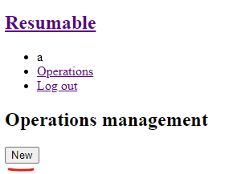
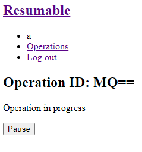
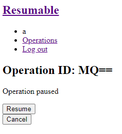

# resumable-celery-tasks
A demonstration of pausing/resuming celery tasks by using the [workflow pattern](https://en.wikipedia.org/wiki/Workflow_pattern) and a [control bus](https://www.enterpriseintegrationpatterns.com/patterns/messaging/ControlBus.html)

The primary thing to demonstrate here is [`tappable.py`](./app/tappable.py). `tappable` is the function that can transform a regular workflow into a "tappable" (resume-able/pause-able) workflow.

However, demonstration of *how to use* `tappable` is equally important. Since the whole design revolves around having a valid workflow pattern and control bus.

It's best to look at the tappable workflow demonstrated in [this commit](https://github.com/TotallyNotChase/resumable-celery-tasks/tree/40099acfa31a6b131da14eba6b95d090e4f06cc5/app/operations.py) first. It uses very basic tasks such as `add` and `mult` - defined [here](https://github.com/TotallyNotChase/resumable-celery-tasks/tree/40099acfa31a6b131da14eba6b95d090e4f06cc5/app/tasks.py).

The current workflow operation is a more realistic demonstration, but is significanctly more complex. Once you have a grip of how to implement a very simple workflow pattern, aided by a simple db based control bus - continue to the complex example in the up-to-date commit.

With that said, most complex operations *can* be converted into the workflow pattern. The concept demonstrated here is very flexible (infact, even without the other celery workflows integrated - `tappable` is still very flexible).

*Any* **non-atomic** task with multiple **logical sequence points** can be converted into a workflow. Though in the practical context, the workflow's required resources should also be transferrable through a messaging protocol (in-memory objects are specific to a runtime won't be trivially transferrable over messages). This may pose as a challenge sometimes, but with enough thought, many in-memory resources can be efficiently represented as *primitive* objects. (Iterative reading a file is a great example - demonstrated on this repo)

And *any* **external state** - accesible through a **non-context-sensitive viewpoint** - can be a control bus. A database entry - given an id of an entry - is a great example, but it can be anything - a file on the filesystem, a web API, you name it.

# Deploy
Run `docker-compose up --build` on the same directory as the `docker-compose.yml`

The app uses a csv file of 1M rows by default. There's also a csv file with 10K rows, if you'd like to use that instead, replace `1M` with `10K` on the dataset moving command - [here](https://github.com/TotallyNotChase/resumable-celery-tasks/blob/master/Dockerfile#L19)

Remember to prune the docker volume incase any configuration changes are made and the app is being redeployed

**NOTE**: This app is for demonstration purposes only, hence it uses `flask run` instead of `gunicorn` + `nginx`

## Note on resource usage
A celery task queue is highly efficient at a large scale (multiple workers, hundres of tasks at once, a full infastructure). However, since this is a very small demo - limited to just one operation. Although the operation is very long, it still doesn't utillize celery's full potential. At this scale, celery's resource usage may seem overkill but it *will* scale very well at an industrial level.

The amount of memory being used may be around 6 GB and a minimum of 4 cores should be present on the system. If the memory usage is too high, change the `backend_cleanup` [periodic task's time interval](https://github.com/TotallyNotChase/resumable-celery-tasks/blob/master/app/config.py#L11) to a lower value greater than 0 (in seconds).

# Usage
* Go to `http://127.0.0.1:5000/signup` and create an account
* Send a `POST` request to `http://127.0.0.1:5000/operations/start` (or simply go to `http://127.0.0.1:5000/operations` and click on the `New` button)
  
  

  This will initiate a tappable (pause/resume-able) operation and return the operation id
* View operation info at `http://127.0.0.1:5000/operations/<operation_id>`
  
  

* Send a `POST` request to `http://127.0.0.1:5000/operations/pause/<operation_id>` to request the operation to pause (or simply go to `http://127.0.0.1:5000/operations/<operation_id>` and click on the `Pause` button)
* Send a `POST` request to `http://127.0.0.1:5000/operations/resume/<operation_id>` to resume a paused operation (or simply go to `http://127.0.0.1:5000/operations/<operation_id>` and click on the `Resume` button)

  

* Send a `POST` request to `http://127.0.0.1:5000/operations/cancel/<operation_id>` to request the operation to cancel (or simply go to `http://127.0.0.1:5000/operations/<operation_id>` and click on the `Cancel` button)

  Note: Operation must be paused before a cancel is attempted

# Explanation
A full explanation on how to implement pause-able/resume-able celery tasks is written [here](./Explanation.md)
